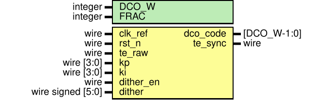

# Entity: dlf_pi 
- **File**: dlf_pi.v
- **Title:**  LFSR Generator for Dithering
- **Author:**  Muhammad Shofuwan Anwar, Ferhad Zulfas, Hardian Tri Pamungkas, Maulidan Imtinan Ahmada

## Diagram

## Description

## Generics

| Generic name | Type    | Value | Description                        |
| ------------ | ------- | ----- | ---------------------------------- |
| DCO_W        | integer | 10    | DCO control word width             |
| FRAC         | integer | 8     | fractional bits (sub-LSB integral) |

## Ports

| Port name | Direction | Type              | Description              |
| --------- | --------- | ----------------- | ------------------------ |
| clk_ref   | input     | wire              | reference clock          |
| rst_n     | input     | wire              | async reset, active low  |
| te_raw    | input     | wire              | e[k] from bbpd           |
| kp        | input     | wire [3:0]        | beta  = 2^kp             |
| ki        | input     | wire [3:0]        | alpha = 2^-ki            |
| dither_en | input     | wire              | enable dither            |
| dither    | input     | wire signed [5:0] | signed dither, LSB units |
| dco_code  | output    | [DCO_W-1:0]       | word to DCO              |
| te_sync   | output    | wire              | te sync                  |

## Signals

| Name       | Type                 | Description                           |
| ---------- | -------------------- | ------------------------------------- |
| te_ff      | reg                  | te flip flop                          |
| acc        | reg  signed [AW-1:0] | integral accumulator                  |
| kp_sh      | wire [4:0]           | clamped proportional                  |
| ki_sh      | wire [4:0]           | clamped integral                      |
| prop_mag   | wire [AW-1:0]        | proportional step magnitude (beta)    |
| prop_step  | wire [AW-1:0]        | signed proportional step (+/- beta)   |
| integ_mag  | wire [AW-1:0]        | integral step magnitude (alpha)       |
| integ_step | wire [AW-1:0]        | signed integral step (+/- alpha)      |
| acc_next   | wire [AW:0]          | accumulator next value (1 bit wider)  |
| acc_over   | wire                 | acc_next above upper saturation limit |
| acc_under  | wire                 | acc_next below lower saturation limit |
| dith_val   | wire [AW+1:0]        | dither shifted to DCO-LSB alignment   |
| pi_sum     | wire [AW+1:0]        | integral + proportional               |
| full_sum   | wire [AW+1:0]        | pi_sum + dither                       |
| code_val   | wire [AW+1:0]        | DCO before clamp                      |

## Constants

| Name     | Type | Value                            | Description |
| -------- | ---- | -------------------------------- | ----------- |
| GUARD    |      | 4                                |             |
| AW       |      | DCO_W + FRAC + GUARD             |             |
| ACC_MAX  |      | ((1 <<< (DCO_W-1)) - 1) <<< FRAC |             |
| ACC_MIN  |      | -ACC_MAX                         |             |
| CODE_MAX |      | (1 <<< DCO_W) - 1                |             |
| CODE_MID |      | (1 <<< (DCO_W-1))                |             |

## Processes
- sync_te: ( @(posedge clk_ref or negedge rst_n) )
  - **Type:** always
- integrator: ( @(posedge clk_ref or negedge rst_n) )
  - **Type:** always
- output_reg: ( @(posedge clk_ref or negedge rst_n) )
  - **Type:** always
